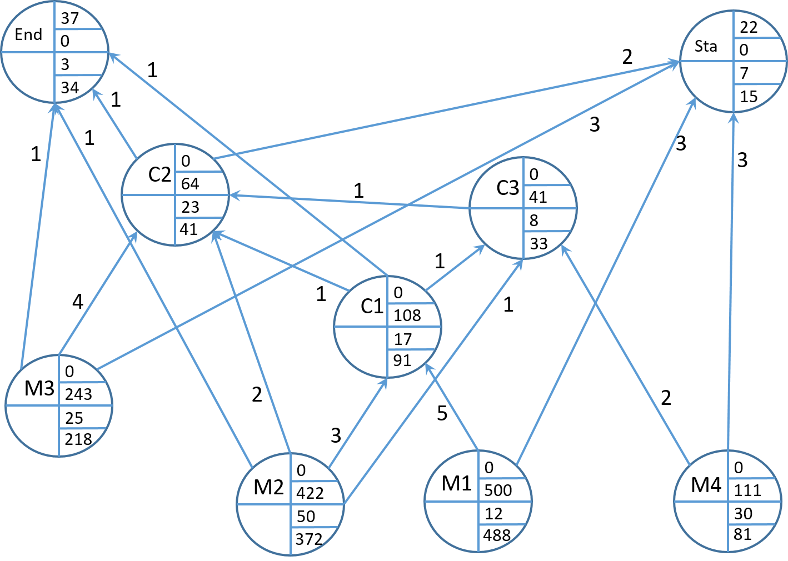

  
```{r, setup, echo=F, include=F, error=FALSE, warning=FALSE, message=FALSE}
library(DT)
library(kableExtra)
library(knitr)
library(tidyverse)
library(forecast)
library(expsmooth)
library(TTR)

# objective function elsp
elsp.obj <- function(csh, cor, y, p,t) cor/t + csh*y*(1-y/p)*t/2

jrp.obj.fun <- function(m , B, cor, csh, cor0) cor0/B + sum(cor/B/m) + sum(csh*B*m)


# function for calculating 1stES forecasts
first.es <- function(y, alpha = .4,  initial = c(mean(y))){
  
  n <- length(y)
  res <- matrix(NA, ncol=3, nrow=n+2)
  rownames(res) <- 0:(n+1)
  colnames(res) <- c("y","a","y.hat")
  
  res["0", c("a")] <- initial
  res[2:(n+1),"y"] <- y
  
  for(i in 2:(nrow(res)-1) ){
    res[i, "y.hat"] <- res[i-1, "a"] 
    res[i, "a"] <- alpha * res[i, "y"] + (1 - alpha) * res[i, "y.hat"]
  }
  res[n+2, "y.hat"] <- res[n+1, "a"]
  return(res)
}


# function for calculating 2ndES forecasts
sec.es <- function(y, alpha = .4, beta = .6, initial = c(mean(y), 0 )){
  
  n <- length(y)
  res <- matrix(NA, ncol=4, nrow=n+2)
  rownames(res) <- 0:(n+1)
  colnames(res) <- c("y","a","b","y.hat")
  
  res["0", c("a","b")] <- initial
  res[2:(n+1),"y"] <- y
  
  for(i in 2:(nrow(res)-1) ){
    res[i, "y.hat"] <- res[i-1, "a"] + res[i-1, "b"]
    res[i, "a"] <- alpha * res[i, "y"] + (1 - alpha) * res[i, "y.hat"]
    res[i, "b"] <- beta * (res[i, "a"]-res[i-1, "a"]) + (1 - beta) * res[i-1, "b"]
  }
  res[n+2, "y.hat"] <- res[n+1, "a"] + res[n+1, "b"]
  return(res)
}

# Normal loss functions - direct
v.fun.direct.norm <- Vectorize(function(s, mu = 0, sigma = 1){
  integrate(function(y) (y-s)*dnorm(y, mean=mu, sd = sigma), lower = s, upper=Inf)$value
})

# deviation Beta vs. exp. loss 
v.diff.norm <- function(x, beta, mu = 0, sigma = 1, L,  c.or, c.sh){
  (v.fun.direct.norm(x[1], mu = L*mu, sigma = sqrt(L)*sigma) - (1-beta)*x[2])
}


v.diff.norm.q <- function(s, q, beta, mu = 0, sigma = 1, L,  c.or, c.sh){
  (v.fun.direct.norm(s, mu = L*mu, sigma = sqrt(L)*sigma) - (1-beta)*q)^2
}


################################################
# Optimization under beta service level constraint

sq.cost <- function(x, c.or, c.sh,mu, L, beta, sigma){
  c.sh *(x[2]/2 + x[1] - mu*L) + c.or*mu/x[2]
}


iter.sq <- function(mu = 100, sigma = 30, L = 8, c.or = 120, c.sh = 0.024, beta = .95){
  
  iter <- 1
  q.opt.old <- Inf
  lambda.opt <- 0
  ef <- 0

  repeat{
    q.opt <- sqrt(2*(mu*c.or+lambda.opt*ef) /(c.sh))
    if( abs(q.opt.old - q.opt) <= 1e-4 )  return(c(s.opt, q.opt))
    ef <- (1-beta)*q.opt
    s.opt <- optim(fn = v.diff.norm.q, par = mu*L, lower = 0, upper = mu*L*5, method="L-BFGS-B", mu = mu, sigma = sigma, q = q.opt, beta = beta, L = L)$par
    lambda.opt <- c.sh*q.opt/(1-pnorm(s.opt, mean = L*mu, sd = sqrt(L)*sigma ))
    res <- c(iter, q.opt, ef, s.opt, lambda.opt)
    names(res) <- c("iter","q","ef","s","lambda")
    print(res)
    q.opt.old <- q.opt
    iter <- iter + 1
    if(iter > 100) break
  }
  
}


```

This is the exam for the course "Inventory Management" for the summer term 2020. In total 60 points are distributed to 3 tasks. When solving a task completely and correctly, 20 points are credited. Subtasks are annotated with the corresponding number of points. Thus, all tasks have to be solved to reach all points. Allowed auxiliary materials are a) a calculator, and b) one sheet of paper (DIN A4 format), handwritten (potentially on both sides). In all calculations round to 3 digits (if necessary).

Good luck!

# Task 1: MRP

The company "LeftWing" produces of drones. The start-up is launching an automated cellular production system. The associated management system is to be set up with the production related data. Therefore, the systems output is compared to the by-hand calculation of next weeks material requirement plan. The two main products are called "Enduro" (End) and "Star" (Sta) of which 37 and 22 units are ordered for the next week, respectively. Inventory records for the raw materials (M1,...,M4) and components (C1,...,C3) are as follows:

|material id | M1 | M2 | M3 | M4 | C1 | C2 | C3 | End | Sta |
|:------------|----|----|----|----|----|----|----|----|----|
| inventory level | 12 | 50 | 25 | 30 | 17 | 23 | 8 | 3 | 7 |

The assembly processes are shown in the following matrix of direct production coefficients: 

```{r, echo=FALSE, include=T}
A <- matrix(0, ncol=9, nrow=9)
colnames(A) <- rownames(A) <- c("End","Sta","C1","C2","C3","M1","M2", "M3", "M4")
A[,"End"] <- c(0,0,1,1,0,0,1,1,0) 
A[,"Sta"] <- c(0,0,0,2,0,0,0,3,3) 
A[,"C1"] <-  c(0,0,0,0,0,5,3,0,0) 
A[,"C2"] <-  c(0,0,1,0,1,0,2,4,0)
A[,"C3"] <-  c(0,0,1,0,0,0,1,0,2)
#set.seed(123)
#tmp <- sample(1:9, 9)
#tmp2 <- sample(1:9, 9)
#A2 <- A[tmp,]
#A3 <- A2[,tmp2]
A

# solution
G <- round(solve(diag(1, ncol(A)) - A))
x <- c(37,22,0 ,0 ,0,0,0,0,0)
s <- c(3 , 7, 17,23,8,12,50,25,30)
net.dem <- G %*% (x-s)
```

1. Help the management and draw a tree graph of the production process. Determine the production stages of each material. (*8 points*)

```{r, echo=FALSE, fig.show = "hold", out.width = "49%", fig.align = "default"}
include_graphics(c("tree1.png", "tree2.png"))
```

2. Deduce the Gozinto graph of the production process and calculate the net demand of all materials. (*12 points*)



# Task 2: Periodic review system 

"Leftwing" intends to provision the most-demand material "M1" via its own warehouse. To control the stocks a periodic review system is to be established, whereby every week an order is made. The dedicated supplier promises a lead time of 3 weeks. "Leftwing" wants to assure a stock availability of 98%. The weekly demand is assumed to be normally distributed with $\mu = 400$ and $\sigma = 100$.

1. Determine the risk period and the distribution of demand in the risk period. (*3 points*)

The risk period is $RP = T + L = 1 + 3 = 4$ weeks. Thus, the demand in the risk period is normally distributed with $Y^{RP} \sim N(4 \cdot 400= 1600, 4 \cdot 100^2 )$ (alternatively, $\mu^{RP} = 1600$ and $\sigma^{RP} = 200$)

2. Calculate the order-up-to level $S$ if an $\alpha$ or a $\beta$ service level of 98% should be assured (risk period definition). (*6 points*)

If $S$ should assure  $\alpha \geq 98\%$, the safety factor is $z_{\alpha} \approx 2.0676$ such that $S_{\alpha} = \mu_{RP} + z_{\alpha} \cdot \sigma_{RP} = 1600 + 2.0676 \cdot 200 = 2013.52 \approx 2014$ units.

If $S$ should assure  $\beta \geq 98\%$, the expected shortfall should be less than $(1-\beta) \cdot \mu_{RP} = 32$. Thus, the safety factor $z_{\beta}$ solves $z_{\beta} = L^{-1}\left(Z, \frac{(1-\beta) \cdot \mu_{RP}}{\sigma_{RP}} \right) = L^{-1} (Z,0.16) \approx 0.62$. Therefore, $S_{\beta } = 1600 + 0.62 \cdot 200 = 1724$ units.

3. A manager of "Leftwing" has second thoughts about the supplier. She suggests to assume that a lead time of 3 weeks is realized with 60% probability while in 30% of all cases 4 weeks elapse before the order arrives. With 10% probability the lead time is 5 weeks. Calculate $S$ by approximating the demand in the lead time assuming an $\alpha$ service level of 98% should be assured. Therefore, calculate the expected lead time and lead time variance first. (*6 points*)

The expectation and variance of the lead time $L$ are $\mu^L = 0.6 \cdot 3 + 0.3 \cdot 4 + 0.1 \cdot 5= 3.5$. The standard deviation of $L$ is $\sigma^L = \sqrt{0.6 \cdot (3-3.5)^2 + 0.3 \cdot (4-3.5)^2 + 0.1 \cdot (5-3.5)^2} = 0.6708204$. Thus, for $\mu_{RP} = \mu_y \cdot \mu_L + T \cdot \mu_y = 400 \cdot (3.5 + 1 ) = 1800$ and $\sigma_{RP} = \sqrt{\mu_L \cdot \sigma^2_y + \mu^2_y \cdot \sigma_L^2 + T \cdot \sigma_y^2} = \sqrt{3.5\cdot 100^2 + 400^2\cdot 0.6708204^2+ 1\cdot 100^2 } = 342.053$. 
Thus, $S_{\alpha} = 1800 +  2.0676 \cdot 342.053 \approx 2507$ units.

4. As the solution of 3. is just an approximation, in which range would you expect $S$ when the lead time distribution is considered exactly? (*5 points*) 

Somewhere between the $\alpha$-quantiles when $L=4$ and L=5$. I.e., $S^{L=4}_{\alpha} = 5 \cdot 400 + 2.0676 \cdot \sqrt{5} \cdot 100 \approx 2462$ and $S^{L=5}_{\alpha} = 6 \cdot 400 + 2.0676 \cdot \sqrt{6} \cdot 100 \approx 2906$.

Hint: Use the following tabulated values of the standard normal distribution.

```{r , echo=FALSE}
# solution
#iter.sq(mu = 50, sigma = 25, c.sh = 0.01*1.5, c.or = 250, beta = .98, L = 2)

n <- 75
id.seq <- seq(0,n, by = n/3)
x.vec <- seq(0,3, length.out = n)
den.vec <- dnorm(x.vec)
cum.vec <- pnorm(x.vec)
los.vec <- v.fun.direct.norm(x.vec)

res <- cbind(x.vec, den.vec, cum.vec, los.vec)

df <- data.frame(res[(id.seq[1]+1):id.seq[2],] , res[(id.seq[2]+1):id.seq[3],], res[(id.seq[3]+1):id.seq[4],])
colnames(df) <- rep(c("$z$","$\\varphi(z)$","$\\Phi(z)$", "$L(Z,z)$"), 3)
df <- round(df, 4)
kable(df, "latex", row.names = F, col.names = rep(c("$z$","$\\varphi(z)$","$\\Phi(z)$", "$L(Z,z)$"), 3), escape = F)%>%
  column_spec (c(4,8),border_left = F, border_right = T) %>%
kable_styling()
```

# Task 4: Joint Economic Lot Sizing

The main component of all drones produced by "Leftwing" are the rotors. In total, "Leftwing" manufactures 5 different type of rotors labeled R1 to R5. All are produced on the same machine. The production-specific information are summarized as follows:

| component | R1 | R2 | R3 | R4 | R5 | 
|:----------|----|----|----|----|----|
| holding cost rate $c^{sh}_i$ | 0.20 | 0.15 | 0.17 | 0.25 | 0.17 | 
| setup cost $c^{or}_i$        | 50   | 250  | 185  | 50   | 150  | 
| demand rate $y_i$            | 25   | 15   | 10  | 30   | 20   | 
| production rate $p_i$        | 150  | 100  | 90  | 110  | 120  | 
| setup time $s_i$             | 0.1  | 0.1  | 0.1 | 0.2  | 0.2  |       

1. Calculate the independent and the common-cycle solution as well as the associated total costs. Is the independent solution feasible? (*10 points*)

The independent solution is given by calculating $T_i = \sqrt{\frac{2 \cdot c^{or}_i}{c^{sh}_i \cdot y_i \cdot (1-\rho_i)}}$ and $b_i = T_i \cdot \rho_i + s_i$.

```{r, echo = F}
c.sh <-  c(.20 , .15 , .17, .25 , .17)
c.or <-  c(50  , 250 , 185, 50  , 150)
y.vec <- c(25  , 15  , 10 , 30  , 20)
p.vec <- c(150 , 100 , 90 , 110 , 120)
s.vec <- c(.1  , .1  , .1 , .2  , .2)
rho.vec <- y.vec/p.vec

kappa <- 1-sum(rho.vec)
#kappa 
# independent solution ##############################
T.vec <- sqrt(2*c.or/c.sh/y.vec/(1-rho.vec))
bat.vec <- T.vec*rho.vec + s.vec
# cost of independent solution
c.cost.ind <- elsp.obj(csh = c.sh, cor = c.or, y = y.vec, p = p.vec , t = T.vec)
#c.cost.ind

dat <- round(rbind(rho.vec, T.vec, bat.vec, c.cost.ind),2)
rownames(dat) <- c("rho","T", "b", "cost")
dat

# common cycle solution ##############################
T.com.opt <- sqrt(2*sum(c.or)/sum(y.vec*c.sh*(1-y.vec/p.vec)))
T.com.min <- sum(s.vec)/(1-sum(y.vec/p.vec))

T.com <- max(T.com.opt, T.com.min)
```

The total cost of the independent solution is `r round(sum(c.cost.ind),2)`. The solution is probably not feasible as the batch time of product does not fit between subsequent lots of products 1 and 4.

The common cycle solution, first calculates $T^{best} = \max(T^*, \underline{T})=$ `r round(T.com,2)` with $T^*=\sqrt{\frac{2\cdot \sum c_i^{or}}{\sum c_i^{sh} \cdot y_i \cdot (1-\rho_i)}}=$ `r round(T.com.opt,2)` and $\underline{T} =\frac{\sum s_i}{1-\sum \rho_i}=$ `r round(T.com.min,2)`.

```{r, echo = F}
#sum(c.cost.ind)
#T.vec
#bat.vec
#sum(bat.vec)

# common cycle solution ##############################
T.com.opt <- sqrt(2*sum(c.or)/sum(y.vec*c.sh*(1-y.vec/p.vec)))
T.com.min <- sum(s.vec)/(1-sum(y.vec/p.vec))

T.com <- max(T.com.opt, T.com.min)
#T.com.min
#T.com
bat.vec.com <- T.com * y.vec/p.vec + s.vec
# cost of independent solution
c.cost.com <- elsp.obj(csh = c.sh, cor = c.or, y = y.vec, p = p.vec , t = T.com)
#c.cost.com
#sum(c.cost.com)
dat <- round(rbind(bat.vec.com, c.cost.com),2)
rownames(dat) <- c("b", "cost")
dat
```
The total cost of the common-cycle solution is `r round(sum(c.cost.com),2)`.

2. Calculate the first iteration of the power-of-2 heuristic. Is the solution feasible? (*10 points*)

First, the basic cycle interval $B$ is to be determined as $B=\min(T_i)$ of the independent solution,i.e., $B=$ `r round(min(T.vec),2)`. Then, the multiplier $m_i = \frac{T_i}{B}$ are calculated and rounded the closest powre of 2.

```{r, echo=FALSE, include=T}
# heuristic
B <- min(T.vec)
m.vec <- sqrt(2*c.or/B^2/c.sh/y.vec/(1-rho.vec))
# round to closest power of 2
# 1st iteration
m.vec.r <- 2^round(log(m.vec)/log(2))

dat <- round(rbind(m.vec, m.vec.r),2)
rownames(dat) <- c("m","m*")
dat

B.opt <- sqrt(2*sum(c.or/m.vec.r)/sum(c.sh*y.vec*m.vec.r*(1-rho.vec)))
B.min <- sum(s.vec/m.vec.r)/kappa
B <- max(B.opt, B.min)

```

Afterwards,$B$ is reoptimized by $B^* = \sqrt{\frac{ 2 \cdot \sum \frac{c_i^{or}}{m_i^*}} {\sum c_i^{sh} \cdot y_i \cdot m_i^* \cdot (1-\rho_i)} } =$ `r round(B,2)`. Thus, for the batch times $b_i$ and cycle times $T_i$ follows

```{r, echo=FALSE}

c.cost.po2.1 <- elsp.obj(csh = c.sh, cor = c.or, y = y.vec, p = p.vec , t = m.vec.r*B)
bat.vec.po2.1 <- B * m.vec.r * y.vec/p.vec + s.vec
dat <- round(rbind(bat.vec.po2.1, B * m.vec.r),2)
rownames(dat) <- c("b","T")
dat
#B
## 2nd iteration
###change m vector by hand
m.vec.r <- c(1,2,4,1,2)
B.opt <- sqrt(2*sum(c.or/m.vec.r)/sum(c.sh*y.vec*m.vec.r*(1-rho.vec)))
B.min <- sum(s.vec/m.vec)/kappa
B <- max(B.opt, B.min)
c.cost.po2.2 <- elsp.obj(csh = c.sh, cor = c.or, y = y.vec, p = p.vec , t = m.vec.r*B)
bat.vec.po2.2 <- B * m.vec.r * y.vec/p.vec + s.vec
#rbind(m.vec.r, bat.vec.po2.2)
## 3rd iteration
###change m vector by hand
m.vec.r <- c(1,2,2,1,2)
B.opt <- sqrt(2*sum(c.or/m.vec.r)/sum(c.sh*y.vec*m.vec.r*(1-rho.vec)))
B.min <- sum(s.vec/m.vec)/kappa
B <- max(B.opt, B.min)
c.cost.po2.3 <- elsp.obj(csh = c.sh, cor = c.or, y = y.vec, p = p.vec , t = m.vec.r*B)
bat.vec.po2.3 <- B * m.vec.r * y.vec/p.vec + s.vec
#rbind(m.vec.r, bat.vec.po2.3)
#B
## 4th iteration
###change m vector by hand
m.vec.r <- c(1,2,2,1,1)
B.opt <- sqrt(2*sum(c.or/m.vec.r)/sum(c.sh*y.vec*m.vec.r*(1-rho.vec)))
B.min <- sum(s.vec/m.vec)/kappa
B <- max(B.opt, B.min)
c.cost.po2.3 <- elsp.obj(csh = c.sh, cor = c.or, y = y.vec, p = p.vec , t = m.vec.r*B)
bat.vec.po2.3 <- B * m.vec.r * y.vec/p.vec + s.vec
#rbind(m.vec.r, bat.vec.po2.3)
#B
```

As the idle time in each basic period is just $4.43-0.84-1.41 = 2.18$, the solution is not feasible as $b_2 = 2.76 > 2.18$.

