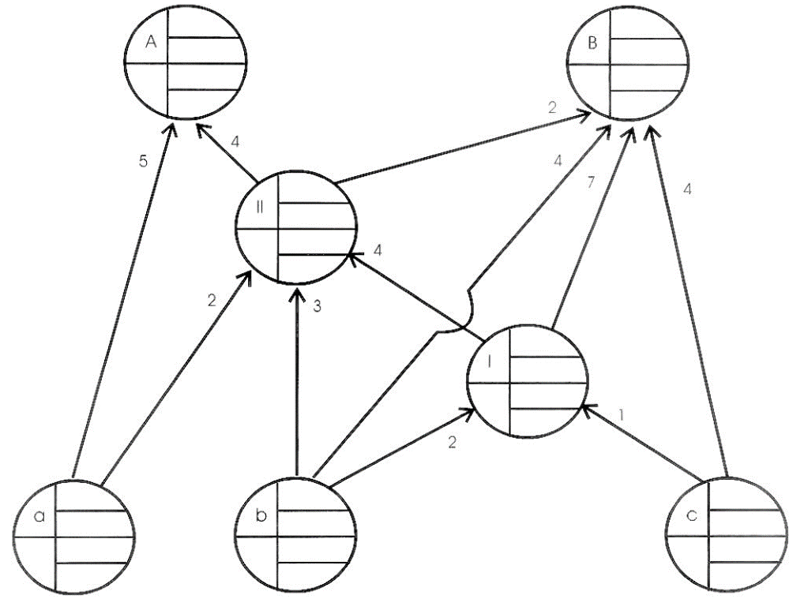
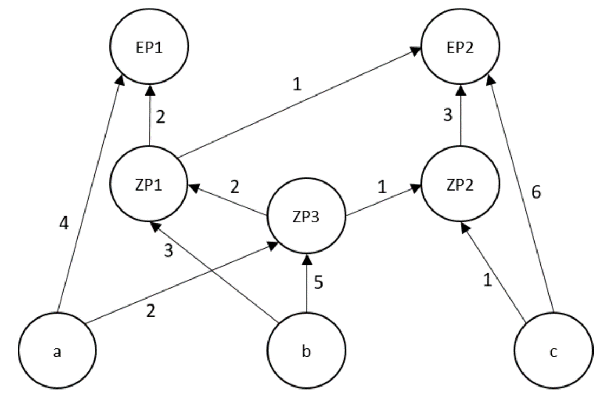

```{r, setup, echo=F, include=T}
library(DT)
library(kableExtra)
library(knitr)
```

# Net demand calculation

The following Gozinto graph displays the assembly process of two final products (A and B). 

{#id .class width=75% height=50%}

The customer demands for products A and B are estimated to be 75 and 80 units, respectively. The external spare part demand for parts I and II is estimated at 10 and 15 units, respectively. The stock levels in the production system are given by $(s_A,s_B,s_{I},s_{II},s_a,s_b,s_c)=(5,2,0,10,25,37,45)$.

1. Display the production process in modular lists and derive the direct production coefficient matrix $A$.
2. Determine the gross demand matrix $G$.
3. Calculate the net demand for all products, parts, and materials.

# Multi-period net demand calculation

The following Gozinto graph displays the assembly process of two final products (EP1 and EP2). 

{#id .class width=75% height=50%}

For calculating the material demand on  a daily basis, the production plan of the following week (days 6-10) is used. Stock levels, lead time, and external demands are summarized in the following table:

|  | stock level | lead time | dem. 6 | dem. 7 | dem 8 | dem. 9 | dem. 10 |
|:------|-----:|:---:|:----:|:----:|:----:|:----:|:----:|
EP1 | 15  | 0 |  5  | 0  | 7 | 0 | 10 |
EP2 | 25  | 1 |  0  | 15 | 0 | 20 | 0 |
ZP1 | 20  | 1 |  5  | 0 | 0 | 0 | 0 |
ZP2 | 50  | 1 |  10 | 0 | 0 | 0 | 0 |
ZP3 | 45  | 2 |  5  | 0 | 0 | 0 | 0 |
a   | 75  | 0 |  0  | 0 | 0 | 0 | 0 |
b   | 50  | 1 |  0  | 0 | 0 | 0 | 0 |
c   | 100 | 2 |  0  | 0 | 0 | 0 | 0 |

1. Display the production process in a tree graph and determine the production stages of each component.
2. Calculate the net demands over time for all components.
3. Assume the stock levels of materials a and b should be 250 at beginning of next week. When should the orders be placed?
4. Assume that  material provision plan derived in 2. is be evaluated on the basis of total logistics cost. Which types of cost be considered  and how could the plan be adapted in order to save costs?