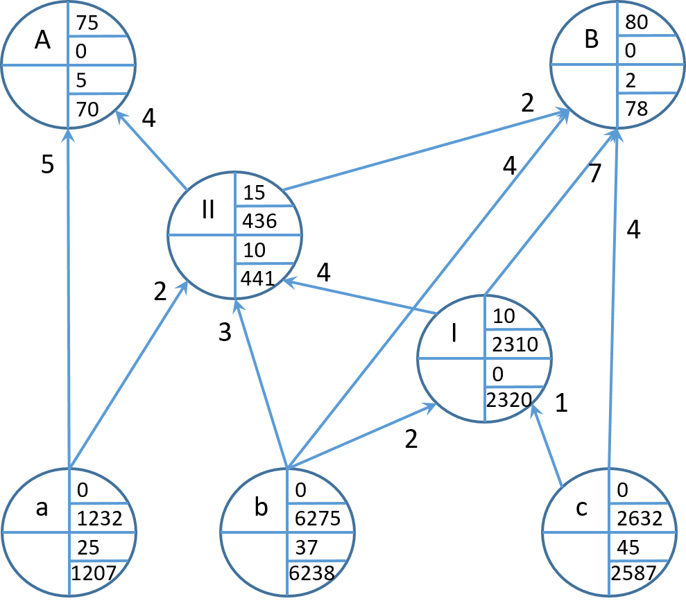
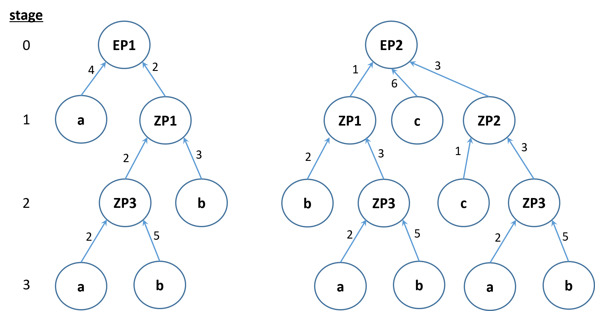

```{r, setup, echo=F, include=T}
library(DT)
library(kableExtra)
library(knitr)

A <- matrix(0, ncol=8, nrow=8)
colnames(A) <- rownames(A) <- c("EP1","EP2","ZP1","ZP2","ZP3","a","b", "c")
A[,"EP1"] <- c(0,0,2,0,0,4,0,0) 
A[,"EP2"] <- c(0,0,1,3,0,0,0,6) 
A[,"ZP1"] <- c(0,0,0,0,2,0,3,0)
A[,"ZP2"] <- c(0,0,0,0,1,0,0,1)
A[,"ZP3"] <- c(0,0,0,0,0,2,5,0)

stag.vec <- c(0,0,1,1,2,3,3,3)
stock.vec <- c(15,25,20,50,45,75,50,100)
lt.vec <- c(0,1,1,1,2,0,1,2)
dem.mat <- matrix(0, ncol = 8, nrow = 10)
colnames(dem.mat) <- colnames(A)
dem.mat[c(6,8,10),"EP1"] <- c(5,7,10)
dem.mat[c(7,9),"EP2"] <- c(15,20)
dem.mat[c(6),"ZP1"] <- c(5)
dem.mat[c(6),"ZP2"] <- c(10)
dem.mat[c(6),"ZP3"] <- c(5)

dyn.mrp <- function(A, stages, stocks, dem.mat, lead.times ){
  # A ... direct prod. coef. matrix (n x n)
  # stages ... integer vector of prod. stages (n x 1)
  # stocks ... vector of initial stocks (n x 1)
  # dem.mat ... demand matrix (t x n)
  # lead.times ... integer vector of prod. lead times (n x 1)
  # names of products
  nam.vec <- colnames(A)
  names(lead.times) <- nam.vec
  # number of products
  n.prod <- nrow(A)
  # number of periods
  n.per <- nrow(dem.mat)
  # initialize result matrix
  res.mat <- matrix(0, nrow = nrow(dem.mat), ncol = ncol(A)*6 )
  colnames(res.mat) <- c(
    paste(nam.vec, "extDem", sep="-"),
    paste(nam.vec, "intDem", sep="-"),
    paste(nam.vec, "groDem", sep="-"),
    paste(nam.vec, "stocks", sep="-"),
    paste(nam.vec, "netDem", sep="-"),
    paste(nam.vec, "iniDem", sep="-")
  )
  # initial stocks in res.mat
  res.mat[1, grepl("stocks", colnames(res.mat))] <- stocks
  # write external demand in res.mat
  res.mat[,1:n.prod] <-  dem.mat
  # max. nb. prod stages
  stag.max <- max(stages)
  # list with materials per prod. stage
  prod.set <- lapply(0:stag.max, function(x) nam.vec[stages == x] )
  names(prod.set) <- 0:stag.max
  
  for(i in 0:stag.max){
    tmp.prods <- prod.set[[i+1]]
    for(j in tmp.prods){
      # int dem mat
      tmp.a <- A[j, ]
      tmp.int.dem.prod <- tmp.a[tmp.a > 0]
      # calculate internal demand
      if(length(tmp.int.dem.prod) > 0){
        res.mat[, paste(j,"intDem", sep="-")] <- rowSums(t(t(res.mat[,paste(names(tmp.int.dem.prod),"iniDem", sep="-")]) * tmp.int.dem.prod))
      }
      # calculate gross demand 
      res.mat[, paste(j,"groDem", sep="-")] <- res.mat[, paste(j,"intDem", sep="-")] + res.mat[, paste(j,"extDem", sep="-")]
      # calculate net demand 
      for(t in 1:nrow(dem.mat)){
        tmp.withdrw <- min(res.mat[t, paste(j,"groDem", sep="-")] , res.mat[t, paste(j,"stocks", sep="-")])
        res.mat[t, paste(j,"netDem", sep="-")] <- res.mat[t, paste(j,"groDem", sep="-")] - tmp.withdrw
        if(t < nrow(dem.mat)){
          res.mat[t+1, paste(j,"stocks", sep="-")] <- res.mat[t, paste(j,"stocks", sep="-")] - tmp.withdrw
        }
      }
      # initialization
      res.mat[, paste(j,"iniDem", sep="-")] <- c(res.mat[(lead.times[j]+1):n.per, paste(j,"netDem", sep="-")], rep(0, lead.times[j]) )
    }
  }
  return(res.mat)
}

```

# Net demand calculation

1. Display the production process in modular lists and derive the direct production coefficient matrix $A$.

```{r, exe2-1, echo=T, collapse=TRUE}
A <- matrix(0, ncol=7, nrow=7)
colnames(A) <- rownames(A) <- c("A","B","II","I","a","b","c")
A[,"A"] <- c(0,0,4,0,5,0,0) 
A[,"B"] <- c(0,0,2,7,0,4,4) 
A[,"II"]<- c(0,0,0,4,2,3,0)
A[,"I"] <- c(0,0,0,0,0,2,1)
A
```

2. Determine the gross demand matrix $G$.

```{r, exe2-2, echo=T, collapse=TRUE}
G <- round(solve(diag(1, 7) - A))
G
```

3. Calculate the net demand for all products, parts, and materials.

<div class="columns-2">

```{r, exe2-3, echo=FALSE, collapse=TRUE, out.width="50%"}
x <- c(75,80,15,10,0,0,0)
s <- c(5,2,10,0,25,37,45)
G %*% (x-s)
```

{#id .class width=50% height=50%}

</div>

# Multi-period net demand calculation

1. Display the production process in a tree graph and determine the production stages of each component.

{#id .class width=75% height=50%}

2. Calculate the net demands over time for all components.

```{r, exe2-4, collapse=T, echo=F }
A <- matrix(0, ncol=8, nrow=8)
colnames(A) <- rownames(A) <- c("EP1","EP2","ZP1","ZP2","ZP3","a","b", "c")
A[,"EP1"] <- c(0,0,2,0,0,4,0,0) 
A[,"EP2"] <- c(0,0,1,3,0,0,0,6) 
A[,"ZP1"] <- c(0,0,0,0,2,0,3,0)
A[,"ZP2"] <- c(0,0,0,0,1,0,0,1)
A[,"ZP3"] <- c(0,0,0,0,0,2,5,0)

stag.vec <- c(0,0,1,1,2,3,3,3)
stock.vec <- c(15,25,20,50,45,75,50,100)
lt.vec <- c(0,1,1,1,2,0,1,2)
dem.mat <- matrix(0, ncol = 8, nrow = 10)
colnames(dem.mat) <- colnames(A)
dem.mat[c(6,8,10),"EP1"] <- c(5,7,10)
dem.mat[c(7,9),"EP2"] <- c(15,20)
dem.mat[c(6),"ZP1"] <- c(5)
dem.mat[c(6),"ZP2"] <- c(10)
dem.mat[c(6),"ZP3"] <- c(5)

res.mat <- t(dyn.mrp(A=A, stages = stag.vec, stocks = stock.vec, dem.mat = dem.mat, lead.times = lt.vec))
# rearrange matrix
lapply(paste(rownames(A),"-", sep=""), function(x)  res.mat[grepl(x, rownames(res.mat)),] )
```

3. Assume the stock levels of materials a and b should be 250 at beginning of next week. When should the orders be placed?

For materials $a$ and $b$ additional lots of 175 and 200 units should be initialized, respectively. Due to the different lead times, for material $a$, 175 units are triggered in period $6$ and for material $b$ 200 units are initialized in period $5$.   

4. Assume that  material provision plan derived in 2. is to be evaluated on the basis of total logistics cost. Which types of cost should be considered and how could the plan be adapted in order to save costs?

Types of cost:

- stock-holding cost
- ordering/setup cost
- (obsolence cost)
- (backorder cost)

Total cost can be reduced potentially by consolidating future demand in joint lots. Thereby, setup costs can be reduced at the expense of stock-holding cost $\Rightarrow$ dynamic lot-sizing problem

